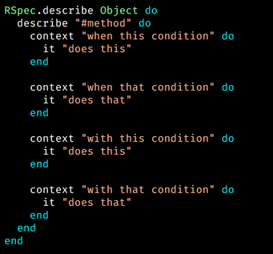
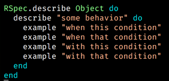

# Bonus Round
## A Smell I Couldn't Name Before I Knew About AAA
  * `acting_in_the_arrange_step_spec.rb`

## Know Your <strike>Meme</strike> RSpec Patterns

### The describe "#method"/describe ".method" pattern
  * 
  * `rippling_contexts_spec.rb`
  * `metaprogrammed_rippling_contexts_spec.rb`

### describe Object; describe "does this behavior"; example "when condition"
  * 
  * `examples_dont_ripple.rb`
